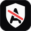

<div align="center">
  
  
  # noadmin.info
  
  **Stop requesting Administrator permission. Build secure Discord bots.**

  [](LICENSE)
  [](https://nextjs.org/)
  [](https://www.typescriptlang.org/)
  [](https://tailwindcss.com/)

  [Live Site](https://noadmin.info) • [Contributing](CONTRIBUTING.md) • [Report Bug](https://github.com/CodeMeAPixel/NoAdmin/issues)
</div>

---

## 🛡️ About

**noadmin.info** is an educational resource for Discord bot developers, promoting the principle of least privilege. The site teaches developers why requesting Administrator permission is harmful and provides tools to calculate the exact permissions their bots need.

### Why This Exists

Too many Discord bots request Administrator permission "for convenience" when they only need a handful of specific permissions. This practice:

- 🔓 Creates unnecessary security risks
- 😰 Erodes user trust
- ❌ Gets bots rejected from bot lists like [top.gg](https://top.gg) and [discord.bots.gg](https://discord.bots.gg)
- 💥 Can lead to catastrophic damage if the bot is compromised

## ✨ Features

- **🔢 Permission Calculator** (`/calculator`) — All 52 Discord permissions grouped by category and risk, with a live verdict, shareable URL state, an invite link builder and code snippets for discord.js, discord.py, Serenity, JDA and DiscordGo
- **🔍 Invite Analyzer** (`/analyze`) — Paste any bot invite link or permission number to see what it grants, how risky it is and what a leaked token could do
- **📖 Permission Reference** (`/permissions`) — A page per permission with its value, bit, risk, 2FA requirement and safer alternatives, verified against Discord's docs
- **🤖 Bot Examples** (`/examples`) — The exact permissions ten common bot types need, with a reason for each
- **📚 Guides** (`/guides`) — Short reads on overwrites, role hierarchy, bitfields, intents and handling missing permissions
- **🏷️ README Badge** (`/badge`, `/api/badge`) — An SVG badge generated from your real invite permissions

## 🚀 Getting Started

### Prerequisites

- [Node.js](https://nodejs.org/) 18+ or [Bun](https://bun.sh/) (recommended)
- Git

### Installation

1. **Clone the repository**
   ```bash
   git clone https://github.com/CodeMeAPixel/NoAdmin.git
   cd NoAdmin
   ```

2. **Install dependencies**
   ```bash
   bun install
   # or
   npm install
   ```

3. **Start the development server**
   ```bash
   bun dev
   # or
   npm run dev
   ```

4. **Open your browser**
   
   Navigate to [http://localhost:3000](http://localhost:3000)

## 🛠️ Tech Stack

| Technology | Purpose |
|------------|---------|
| [Next.js 16](https://nextjs.org/) | React framework with App Router |
| [React 19](https://react.dev/) | UI library |
| [TypeScript](https://www.typescriptlang.org/) | Type safety |
| [Tailwind CSS 4](https://tailwindcss.com/) | Styling |
| [Radix UI](https://www.radix-ui.com/) | Accessible components |
| [Biome](https://biomejs.dev/) | Linting & formatting |

## 📁 Project Structure

```
noadmin/
├── public/
│   ├── logo.svg            # Transparent logo
│   ├── logo-solid.svg      # Logo with background
│   ├── favicon.svg         # Browser favicon
│   └── manifest.json       # PWA manifest
├── src/
│   ├── app/
│   │   ├── analyze/        # Invite analyzer
│   │   ├── badge/          # README badge builder
│   │   ├── calculator/     # Permission calculator
│   │   ├── examples/       # Bot examples (+ [slug] pages)
│   │   ├── guides/         # Guides (+ [slug] pages)
│   │   ├── permissions/    # Permission reference (+ [slug] pages)
│   │   ├── api/badge/      # SVG badge endpoint
│   │   ├── api/og/         # OG image endpoint (?title=&subtitle=)
│   │   ├── layout.tsx      # Root layout, header and footer
│   │   └── page.tsx        # Home page
│   ├── components/
│   │   ├── layout/         # SiteHeader, SiteFooter
│   │   ├── tools/          # Calculator, Analyzer, InviteBuilder, SnippetTabs, BadgeBuilder
│   │   └── ui/             # Shared primitives and icons
│   └── lib/
│       ├── permissions.ts  # Permission catalog, BigInt encode/decode, invite parsing
│       ├── analyze.ts      # Verdicts and findings
│       ├── templates.ts    # Bot examples
│       ├── guides.ts       # Guide content
│       └── snippets.ts     # Code snippet generators
├── biome.json
├── next.config.ts
└── tsconfig.json
```

### Updating permissions

When Discord adds a permission, add it to `PERMISSIONS` in `src/lib/permissions.ts` and bump `CATALOG_VERIFIED`. Permission values go past bit 31, so always use `BigInt`, never JavaScript's 32-bit `|` and `&` on plain numbers.

## 📜 Available Scripts

| Command | Description |
|---------|-------------|
| `bun dev` | Start development server |
| `bun build` | Build for production |
| `bun start` | Start production server |
| `bun lint` | Run Biome linter |
| `bun format` | Format code with Biome |

## 🤝 Contributing

Contributions are welcome! Please read our [Contributing Guide](CONTRIBUTING.md) for details on our code of conduct and the process for submitting pull requests.

### Quick Start for Contributors

1. Fork the repository
2. Create a feature branch (`git checkout -b feature/amazing-feature`)
3. Commit your changes (`git commit -m 'Add amazing feature'`)
4. Push to the branch (`git push origin feature/amazing-feature`)
5. Open a Pull Request

## 🔗 Related Resources

- [Discord Developer Documentation](https://discord.com/developers/docs)
- [Discord Permissions Calculator](https://discordapi.com/permissions.html)
- [Discord Permissions Reference](https://discord.com/developers/docs/topics/permissions)
- [OAuth2 Authorization URL Generator](https://discord.com/developers/docs/topics/oauth2)

## 📄 License

This project is licensed under the AGPL 3.0 License see the [LICENSE](LICENSE) file for details.

## 💜 Acknowledgments

- The Discord developer community
- Everyone advocating for better bot security practices
- [top.gg](https://top.gg) and [discord.bots.gg](https://discord.bots.gg) for promoting permission best practices

---

<div align="center">
  <strong>Built with ❤️ for the Discord developer community</strong>
  <br />
  <sub>Not affiliated with Discord Inc.</sub>
</div>
